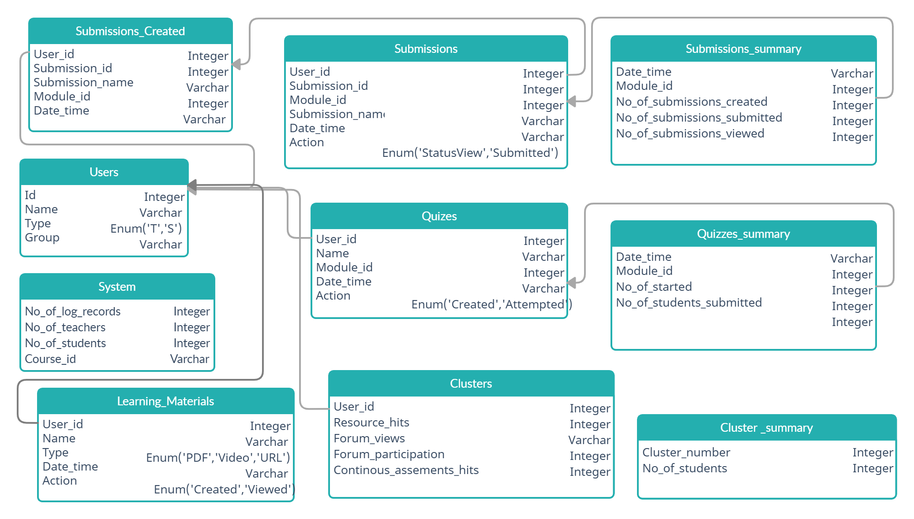
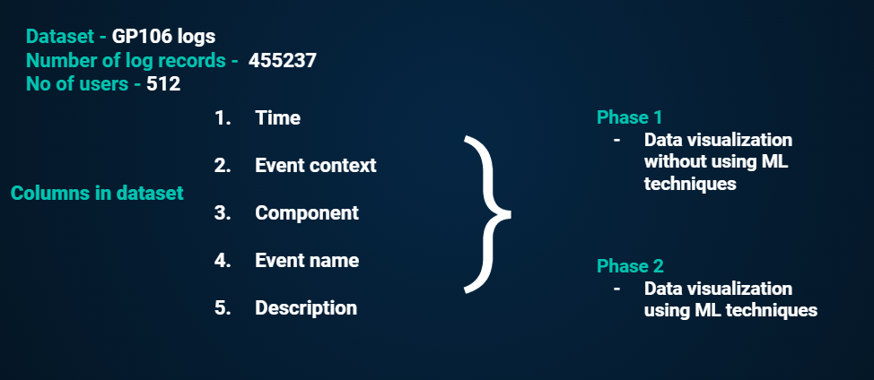
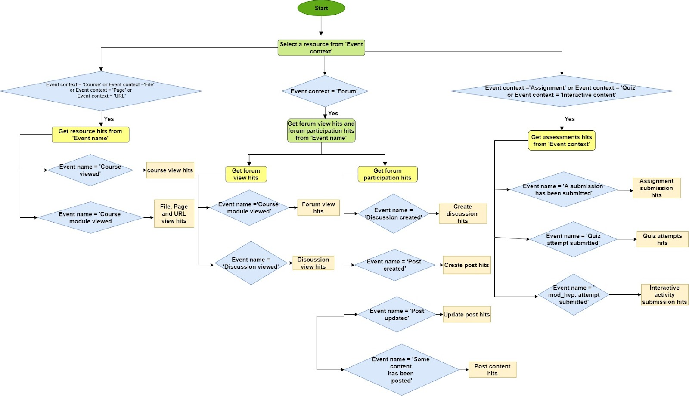
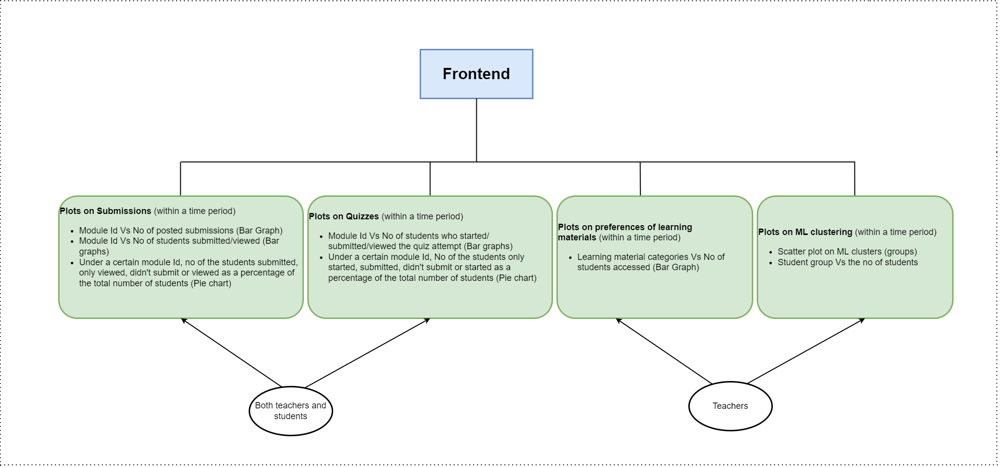

# Teacher Student Activities Based On Moodle Log Data
---

## Table of Contents
1. [Problem Identification](#problem-identification)
2. [Requirement Analysis](#requirement-analysis)
3. [Software Modelling](#software-modelling)
4. [Solution](#solution)
5. [Database Design](#database-design)
6. [Data Selection](#data-selection)
7. [Visualization in Frontend](#visulization-in-frontend)

---

## Problem Identification

 The project is targeted at the domain of online education. As we all know, the world has shifted to doing many things online since the beginning of the COVID pandemic. This has affected education as well. Therefore, online learning was identified as a good alternative in order to fulfil educational requirements in the new normal. The lack of physical interactions in online education gave rise to many issues.
 
 
 

 As an example, if you look at the above two instances of two students learning through online platforms, even though it can be clearly seen that the students are struggling through their academics, the teacher/lecturer is unaware of it. In the physical scenario, because of the real physical interaction, the teachers can observe the students' behaviours, identify if there are any struggles and lend the necessary help.
 
Therefore, the below issues can be identified in online education due to fewer physical interactions.

- Unable to Identify students’ struggles/ behaviours/ preferences
- Unable to lend the necessary support
- Feeling of isolation, losing awareness (students' perspective)
- Students being less motivated

The motivation of the project is to find a way to avoid the mentioned issues and create a better teaching and learning environment in online education ultimately.

## Requirement Analysis
The requirement given by the product owner is to **build a tool that has a visual representation of teacher-student activities based on Moodle log data.**

This tool must be able to give solutions to the problems explained in the problem identification section. Instead of using the physical interactions in traditional education to get information on teacher-student interactions and behaviours, **the log data taken from Moodle** is asked to be used as a resource to extract useful information. This information can then be used to make decisions and make online learning more effective.

One of the key ideas is to build the tool as a **visually pleasing one (with graphs, charts, e.t.c)** where users can easily grab the information. There is already a filtering option given in Moodle to filter through log data. But this is just a text-based filter to obtain the log records.

Identified requirements can be classified as,

**Functional Requirements**

1. Identifying students behavioral patterns
2. Group students with similar behaviors
3. Course and learning material recommendations

**Non-functional Requirements**

1. Performance (response time)
2. User experience (simple GUI)
3. Portability & Integrity

The instructions are given to carry out the project in two phases.

**1. A data visualization phase**
**2. Integration of Machine Learning**

## Software Modelling

## Solution

The solution consists of a **web application** that can be used by **teachers/lecturers and students.**

**Phase 1: A simple visualization**

Features included:

- Simple statistics such as number of log records, number of users in the system.
- A representation of different preferences of students over various learning materials such as videos, pdfs, resource links, quizzes & questionnaires e.t.c.
- A representation of students' progresses on assignments/projects submissions.

**Phase 2: Integration of Machine Learning**

Features included:

- Student groupings using a clustering algorithm based on the learning behaviours.
- Recommendation of selecting courses. eg: General Electives
- Prediction of student GPA's based on learning patterns/behaviours.

**Technologies planned on using are**

- React (Frontend)
- NodeJs (Backend)
- MongoDB or MySQL (Database)

**Unsupervised Machine Learning Algorithms**

- Clustering - K means algorithm
- Recommendations 

**Supervised Machine Learning Algorithms**

- GPA prediction - Regression

## Database Design

## Data Selection

**Phase 1**

**Phase 2**

## Visualization in frontend

## Solution Architecture

.....

## Team
-  E/17/201, Madushani W.T., [email](mailto:e17201@eng.pdn.ac.lk)
-  E/17/352, Tillekeratne L.J.I., [email](mailto:e17352@eng.pdn.ac.lk)
-  E/17/398, Wijerathne I.D.H.S.d., [email](mailto:e17398@eng.pdn.ac.lk)

## Links

- [Project Repository](https://github.com/cepdnaclk/e17-co328-Visualization-of-Teacher-Student-Activities)
- [Project Page](https://github.com/cepdnaclk/e17-co328-Visualization-of-Teacher-Student-Activities/deployments)
- [Department of Computer Engineering](http://www.ce.pdn.ac.lk/)
- [University of Peradeniya](https://eng.pdn.ac.lk/)

[//]: # (Please refer this to learn more about Markdown syntax)
[//]: # (https://github.com/adam-p/markdown-here/wiki/Markdown-Cheatsheet)
